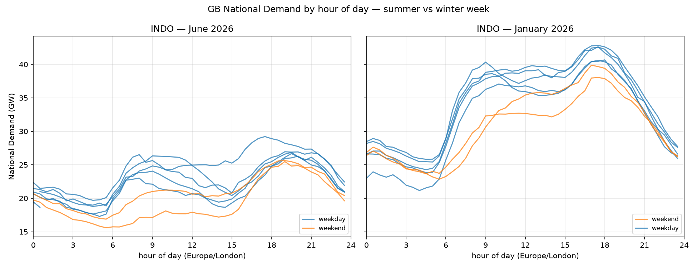

# Log

## 2026-07-13 — Data Status endpoints don't cover demand or wind
All 12 `/data-status/{X}` endpoints are balancing-mechanism datasets (BOALF, BOAV, BOD, DISBSAD, DISEBSP, DISPTAV, EBOCF, FREQ, ISPSTACK, NETBSAD, PN, REMIT). None for INDO/ITSDO/WINDFOR.

→ Publication lag and revision behaviour must be established empirically: re-pull the same settlement date at intervals and diff. Don't go looking for a metadata endpoint that tells you; there isn't one.

## 2026-07-13 — /datasets/ITSDO filters on publish time, not settlement date
Params are `publishDateTimeFrom/To` only; nothing is required. Contrast with `/demand/outturn` (INDO), which filters on settlement date.

→ Two implications: (a) backfilling ITSDO by settlement date needs a generous publish window plus client-side filtering; (b) (settlementDate, settlementPeriod) may not be a unique key — the dataset may be an append-only publication log. UNVERIFIED — test before designing the schema.

## 2026-07-13 — INDO and ITSDO have no /stream variants
Most of the `/datasets/ family` have a stream twin with a lighter JSON payload. INDO and ITSDO don't.

→ Backfilling the primary demand series will use the standard endpoints: heavier payloads, and likely a max query window (check the x-max-day-range-* extensions in swagger.json for both). Chunk the backfill and rate-limit it — there's a documented 429.

## 2026-07-13 — ITSDO probe: structure confirmed
publishTime = startTime + 30min. ITSDO published at end of each SP.

337 rows / 7d window, 0 duplicate (settlementDate, settlementPeriod).
  → clean series, not a publication log. Initial outturn is not revised; revised figures live in settlement data (S0142), weeks later.
  
  → CAVEAT: only tested on a quiet week in June. Re-test on a clock-change week and a winter week before fixing the schema.

Rows carry `startTime` (UTC). No need to derive timestamps on ingest.
  
  → but sp_to_utc() still needed for forecast horizons. Validate it against `startTime` over 2y of history — including all clock changes.

Settlement day starts at LOCAL midnight: SP1 of 2026-06-08 has startTime 2026-06-07T23:00Z (BST). Not a fixed UTC offset.

 → sp_to_utc() must localise via Europe/London.

## 2026-07-13 — Embedded solar is visible in INDO. Confirmed by eye.

June weekdays: ramp to ~26 GW by 09:00, sag to 21–25 GW across 10:00–15:00, then peak 27–29 GW at 18:00–19:00. January: flat daytime plateau 37–40 GW, no midday trough, earlier peak (~17:30).

The midday sag is not behavioural — one June weekday stays flat through midday (presumably overcast). Presence of the dip tracks the sun, which behaviour cannot explain. This is embedded PV serving load behind the meter, invisible at transmission level.

→ INDO is a demand-minus-embedded-solar hybrid, not consumption.

→ UNVERIFIED: quantify by adding estimated embedded solar (/generation/actual/per-type/wind-and-solar) back to INDO and checking the sag flattens. If it doesn't close, the explanation is wrong.

→ Feeds D-002 (target definition: raw INDO vs solar-reconstructed).

Script: scripts/plot_demand_shape.py

## 2026-07-13 — AGWS (wind-and-solar) is sparse and inconsistently published

Endpoint: `/generation/actual/per-type/wind-and-solar`
Columns: publishTime, businessType, psrType, quantity, startTime, settlementDate, settlementPeriod. psrType ∈ {Solar, Wind Onshore, Wind Offshore}.

**Publication lag is 2.5h**, not 30min. startTime 22:00Z → publishTime 00:30Z; 21:00Z → 23:30Z; 20:30Z → 23:00Z. Consistently SP-end + 150min. Contrast INDO/ITSDO at SP-end + 30min. → Daily scoring job must wait on the slowest series, not the fastest. Sets the cron time.

**Rows are missing, and missing ≠ zero.** 25–30 rows/day, not 48. On 2026-06-03 (full interior day, generous query window — not a clipping artefact) 21 SPs absent: 1,2,4–9,12,15,16,17,20,21,22,25,36,38,46,47,48. SP25 = 11:00 UTC = 12:00 local, i.e. a hole in the middle of the solar peak. Meanwhile the dataset DOES publish explicit `Solar, 0.0` rows overnight (e.g. SP47). → So absence is missing data, not absent generation. NEVER fillna(0) on this series. Doing so fabricates observations.

**Merge bug caught here (worth remembering):** left-joining INDO to solar produced 140 NaNs and matplotlib silently drew a fragmented line rather than erroring. Plot looked plausible. Always print .isna().sum() after a merge before plotting.

**Substantive finding survives regardless:** midday solar 5.7–8.7 GW across the week vs a ~4–5 GW midday sag in INDO. Magnitude confirms embedded PV as the cause. Lowest-solar day (2026-06-06, 5.72 GW) — check against the flat weekday in figures/2026-07-13_indo_daily_shape.png.

→ Feeds D-002. Materially weakens the case for reconstructing demand.

Script: scripts/probe_wind_solar.py

## 2026-07-13 — FUELINST contains no SOLAR category at all

Endpoint: /generation/outturn/summary. Nested payload: `data` is a list of dicts per settlement period — needs `pd.json_normalize(payload["data"], record_path="data", meta=["startTime", "settlementPeriod"])`, not a plain normalize.

Fuel types published: BIOMASS, CCGT, COAL, INTELEC, INTFR, INTGRNL, INTIFA2, INTNED, INTNEM, INTVKL, NPSHYD, NUCLEAR, OCGT, OIL, OTHER, WIND.

There is no SOLAR. This is not a gap — the category does not exist. FUELINST is metered transmission-connected generation; GB solar is almost entirely embedded, so it never touches the transmission system and cannot appear here. The embedded-generation problem, stated by the data itself.

→ Closes the search for a complete embedded-solar series. The only two candidates were AGWS (model estimate, ~40% of rows missing incl. at the solar peak — see entry above) and FUELINST (no solar). Neither is metered truth; neither is complete. Resolves D-002.

Incidental, both worth remembering:
- Interconnector flows are visible line-by-line (INTFR 1604, INTVKL 1234, INTNED 774, INTNEM 636, INTELEC 702, INTIFA2 708 MW at SP29 on 07-12). Several GW, moving between periods. This is the price-driven component excluded by choosing INDO over ITSDO (D-001) — mechanism now confirmed directly, not just inferred from the diurnal curve.
- FUELINST WIND (~6.2 GW) ≠ AGWS Wind Onshore + Offshore (~10.3 GW). A third wind definition: metered transmission-connected only, vs AGWS which includes estimated embedded onshore wind. The same definitional problem recurs on the wind side. → D-003 outstanding.

Script: scripts/probe_fuelinst.py